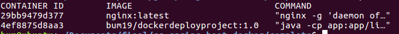
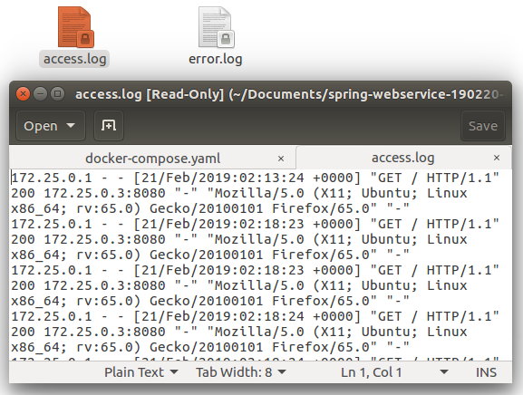
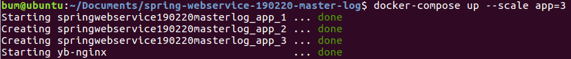
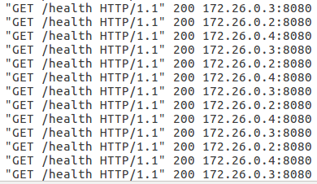
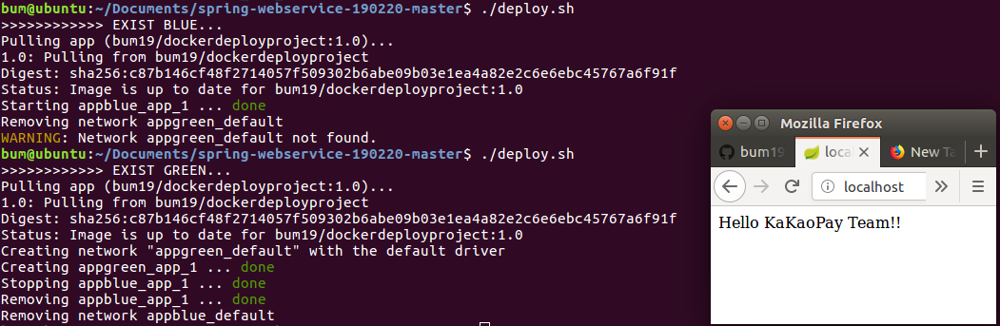
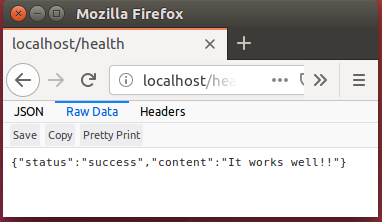

# Docker를 이용한 배포 프로젝트

## 프로젝트 요구사항
1. build script는 gradle로 작성.
   - spring-boot 프로젝트로 스크립트를 gradle로 작성하였습니다.

2. 어플리케이션들은 모두 독립적인 Container 로 구성.
   - nginx와 web service모두 독립적인 Container로 구성하였습니다.



3. 어플리케이션들의 Log 는 Host 에 file 로 적재.
   - host의 log폴더에 실시간으로 쌓입니다.



4. Container scale in/out 가능해야 함.
   - scale in/out 가능합니다.



5. 웹서버는 Nginx 사용.
   - Nginx 사용하였습니다.

6. 웹서버는 Reverse proxy 80 port, Round robin 방식으로 설정.
   - Nginx를 Reverse서버로 사용 균등하게 각 container로 요청을 전달합니다.



7. 무중단 배포 동작을 구현. (배포 방식에 제한 없음)
   - Blue-Green deploy 방식을 이용하여 구현하였습니다.



8. 실행스크립트 개발언어는 bash/python/go 선택하여 작성.
   - bash를 선택하여 작성하였습니다.

9. 어플리케이션 REST API 추가. [GET /health] Health check REST API. 응답결과는 JSON Object 구현.
   - health 체크 응답결과를 JSON object로 반환합니다.



## 사전준비
- Ubuntu
- Java 1.8.x

## 실행방법
1. 해당 프로젝트 전체를 clone합니다.(다운도 상관없음)
2. 실행스크립트를 실행합니다
스크립트가 "Permission denied"로 실행되지 않을때 아래명령어를 이용하세요.
``` bash
chmod +x $(filename)
```

### 실행예
``` bash
# start.sh (웹서비스 실행을 위한 docker compose를 실행 및 재시작)
$ ./start.sh

# stop.sh (웹서비스 중지)
$ ./stop.sh 

# startscale.sh (APP container수를 매개변수로 넘겨 그 수만큼 실행가능)
$ ./startscale 3

# doploy.sh (무중단배포)
$ ./start.sh #서비스가 진행되고 있다고 가정.
$ ./doploy.sh #서비스가 번갈아가며 새로운 소스를 Pull받은후 적용.
```

3. 웹서비스 접속
``` bash
# Hello team!!
$ curl -v http://localhost/

# {"status":"success","content":"It works well!!"}
$ curl -v http://localhost/health
```

## 프로젝트 설명
- health 체크가 가능한 Spring Boot Project로 Docker Image를 만들어 Docker Hub에 쉐어하였습니다.
- Spring Boot Project 이미지와 Nginx 이미지를 이용하여 독립적인 컨테이너들을 만듭니다.
- Nginx가 proxy server역할을 하여 다수의 컨테이너에 요청을 보내는 Load Balancing을 합니다.
- 무중단 배포를 위해 Blue-Green Deployment 방식을 사용하였습니다.
- 로그는 Log폴더에 실시간으로 쌓입니다.


## 추후 프로젝트
- Docker, Travis CI, AWS CodeDeploy를 이용한 배포 자동화 및 무중단 배포 구축하기.


